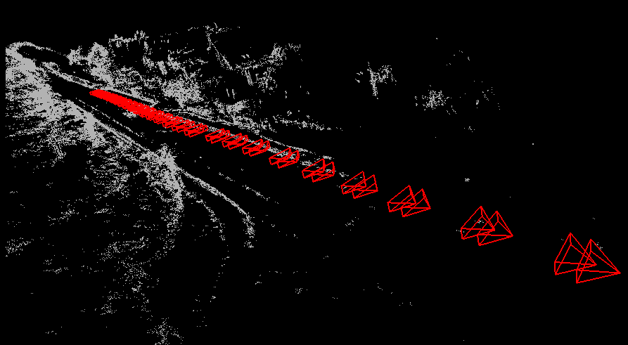

# Direct Stereo Visual Odometry

## Introduction

This is an implemetation of direct stereo visual odometry based on G2O and Opencv. 

+ Track new frame with direct image alignment
+ Sliding window Bundle Adjustment minimizing photometric error [Doing]
+ Initialize depth with fixed baseline stereo image and update with triangulation [Doing]

## Usage

1. Place images under your data folder which contains two sub_folders `image_2` and `image_3`
2. Edit config file refer to config/default.ini
3. compile and run with 
```$xslt
./run_vo config/default.ini
```   

## Result

